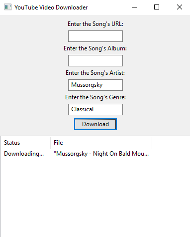

  

# YouTube Converter
An application for downloading videos from YouTube and converting them to MP4 files.

### Prerequisites
* Python 3.6.2
* wxPython 4.0.0b1
* Mutagen 1.40.0
* Pytube 9.2.3
* FFMPEG (Must be added to your system's path as "ffmpeg")
